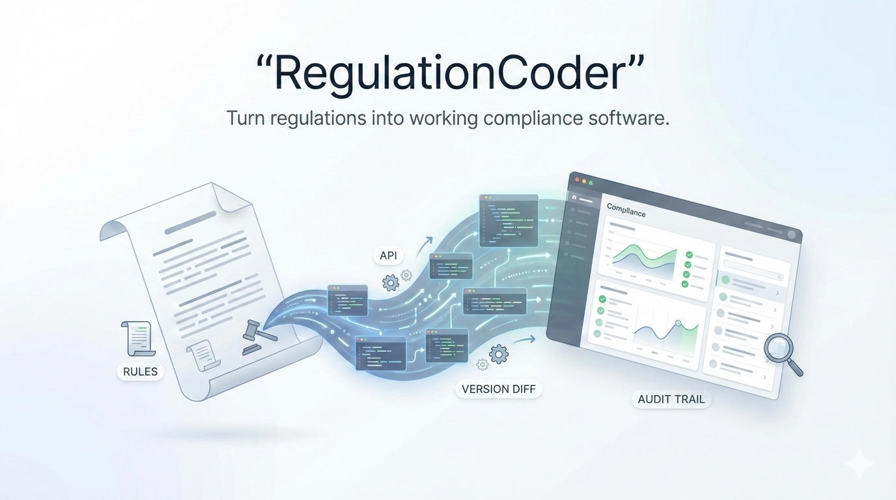

<p align="center">
  
</p>

# RegulationCoder

End-to-end pipeline that converts government regulation documents (PDF/HTML) into working compliance software. Powered by **Anthropic Claude Opus 4.6** as the AI backbone for quality assurance, deep analysis, and intelligent compliance evaluation.

## What it Does

1. **Ingests** regulation documents (EU AI Act PDF)
2. **Parses** articles into structured clauses with deterministic IDs
3. **Extracts** requirements using Claude Sonnet 4.5 (with Judge Gate A validation by Claude Opus 4.6)
4. **Formalizes** requirements into machine-checkable rules (with Judge Gate B validation)
5. **Evaluates** AI system profiles against 53 compliance rules
6. **Analyzes** compliance posture with Claude Opus 4.6 deep AI analysis
7. **Exports** reports (JSON/HTML) with full audit trail

## Demo: EU AI Act Compliance

Evaluates a fictional recruitment AI system ("TalentScreen AI") against EU AI Act Articles 9-15 (high-risk AI requirements).

**Expected result**: Partial Compliance (78.4/100) with critical gaps in automation bias safeguards and disaggregated performance metrics.

## Quick Start

### Prerequisites

- Python 3.12+
- Node.js 18+
- An Anthropic API key

### 1. Clone and Setup

```bash
git clone https://github.com/Mougatsu/claudehackaton.git
cd claudehackaton
```

### 2. Create `.env` file

```bash
cp .env.example .env
# Edit .env and set your ANTHROPIC_API_KEY
```

### 3. Install Python dependencies

```bash
pip install -e .
```

### 4. Start the Backend (FastAPI)

```bash
uvicorn regulationcoder.api.app:app --host 0.0.0.0 --port 8000 --reload
```

The API will be available at http://localhost:8000 (Swagger docs at http://localhost:8000/docs).

### 5. Start the Dashboard (Next.js)

```bash
cd dashboard
npm install
npm run dev
```

The dashboard will be available at http://localhost:3000.

### 6. Run the Demo

1. Open http://localhost:3000/evaluate
2. Click **"Load Demo"** to populate the TalentScreen AI profile
3. Click **"Run Evaluation"** for instant deterministic compliance check
4. Click **"Deep AI Analysis (Claude Opus 4.6)"** for AI-powered deep analysis (~60-90s)

### CLI Usage

```bash
# Run compliance check from command line
regulationcoder check --profile tests/fixtures/talentscreen_profile.json --regulation eu-ai-act-v1

# Verify audit trail integrity
regulationcoder verify-audit --log-dir ./audit_logs
```

## Architecture

```
Regulation PDF → Ingestion → Parsing → Extraction (Claude Sonnet 4.5)
    → Judge Gate A (Claude Opus 4.6) → Formalization (Claude Sonnet 4.5)
    → Judge Gate B (Claude Opus 4.6) → Evaluation Engine
    → Deep AI Analysis (Claude Opus 4.6) → Compliance Report
```

### Tech Stack

| Layer | Technology |
|-------|-----------|
| AI Engine | Anthropic Claude Opus 4.6 + Sonnet 4.5 |
| Backend | FastAPI, Pydantic v2, Python 3.12 |
| Frontend | Next.js 14, Tailwind CSS, shadcn/ui, Recharts |
| CLI | Click + Rich |
| Audit | SHA-256 hash-chained append-only log |

### Key API Endpoints

| Method | Path | Description |
|--------|------|-------------|
| POST | `/api/evaluate/` | Deterministic compliance evaluation |
| POST | `/api/evaluate/ai-analysis` | Deep AI analysis (Claude Opus 4.6) |
| GET | `/api/regulations/` | List loaded regulations |
| GET | `/api/requirements/` | List extracted requirements |
| GET | `/api/rules/` | List compliance rules |
| GET | `/api/audit/logs` | View audit trail |
| GET | `/api/audit/verify` | Verify hash chain integrity |

## Project Structure

```
src/regulationcoder/
  core/         engine.py, judge.py, ai_analyzer.py, pipeline.py, config.py
  models/       clause.py, requirement.py, rule.py, profile.py, evaluation.py, ai_analysis.py
  ingestion/    pdf_processor.py, html_scraper.py
  parser/       segmenter.py, citation_extractor.py, tree_builder.py
  extraction/   requirement_extractor.py (Claude Sonnet 4.5)
  formalization/ rule_generator.py (Claude Sonnet 4.5)
  rules/        eu_ai_act_v1/ (Articles 9-15, 53 rules)
  audit/        logger.py, chain.py (hash-chained audit trail)
  exporters/    json_exporter.py, html_exporter.py
  api/          FastAPI app + routers
  cli/          Click CLI

dashboard/      Next.js 14 frontend
  src/app/      Pages: evaluate, requirements, rules, audit, upload
  src/components/ ScoreCard, ComplianceChart, RuleResultRow
  src/lib/      api.ts (typed API client)
```

## License

MIT
